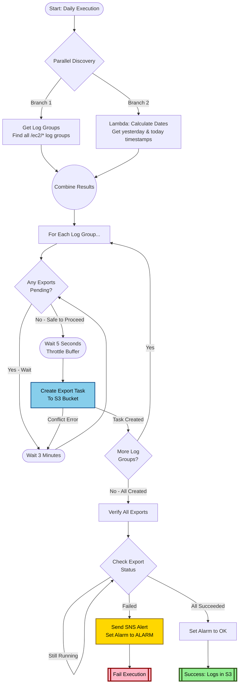

## CloudWatch Logs to S3 Export Automation

### The Challenge

Organizations running applications on EC2 instances generate massive amounts of logs in CloudWatch Logs. While CloudWatch is excellent for real-time monitoring and short-term analysis, it becomes expensive for long-term log retention. The challenge is to:

- **Reduce Costs**: Move logs from CloudWatch to S3 where storage is significantly cheaper (CloudWatch Logs costs ~$0.50/GB vs S3 Standard ~$0.023/GB)
- **Ensure Reliability**: Automate the process to run daily without manual intervention
- **Handle Errors Gracefully**: Detect and alert on failures while implementing intelligent retry logic
- **Avoid Throttling**: CloudWatch Logs API has strict limits on concurrent export operations
- **Maintain Compliance**: Ensure all logs are successfully exported for audit and compliance requirements

### The Solution

This solution uses AWS Step Functions to orchestrate a fully automated, cost-effective log export workflow. The state machine intelligently handles the entire lifecycle of exporting CloudWatch Logs to S3:

**What Makes This Solution Effective:**
- **Cost Optimization**: Exports logs to S3 where long-term storage costs 95% less than CloudWatch Logs
- **Smart Sequencing**: Processes one log group at a time to respect CloudWatch API rate limits
- **Intelligent Waiting**: Checks for existing export operations before starting new ones to prevent conflicts
- **Comprehensive Error Handling**: Built-in retries with exponential backoff and jitter for transient failures
- **Full Visibility**: Sets CloudWatch alarms and sends SNS notifications when exports fail
- **Zero Manual Intervention**: Automatically discovers log groups, calculates time ranges, and validates completion

### How It Works

The solution operates in three main phases:

**Phase 1: Discovery & Preparation** (Runs in Parallel)
- **Discover Log Groups**: Queries CloudWatch Logs to find all EC2 log groups (those with `/ec2/` prefix)
- **Calculate Time Boundaries**: Invokes a Lambda function to determine yesterday's date range (the logs to export) and today's timestamp (the cutoff point)
- Both operations run simultaneously to save time, then their outputs are merged

**Phase 2: Create Export Tasks** (Sequential Processing)
- Iterates through each discovered log group **one at a time** (critical for avoiding API throttling)
- For each log group:
  1. **Check Status**: Calls CloudWatch API to see if any export is currently pending
  2. **Smart Wait**: If an export is running, waits 3 minutes and checks again (prevents conflicts)
  3. **Brief Pause**: If no pending exports, waits 5 seconds as a courtesy throttle buffer
  4. **Create Export**: Starts the export task with the calculated time range to the S3 bucket
  5. **Error Recovery**: If creation fails (e.g., another export started), loops back to wait state

**Phase 3: Verification & Notification**
- Once all export tasks are created, monitors each one until completion
- For each export task:
  1. **Poll Status**: Continuously checks if the export is PENDING, RUNNING, COMPLETED, or FAILED
  2. **Success Path**: When all exports complete successfully → Sets CloudWatch alarm to OK state → Execution succeeds
  3. **Failure Path**: If any export fails → Publishes detailed SNS alert → Sets CloudWatch alarm to ALARM state → Execution fails for visibility

### Visual Workflow



### Architecture Components

#### AWS Services Used

| Service | Role | Specific Resource |
|---------|------|-------------------|
| **Step Functions** | Orchestration engine | State machine with JSONata query language |
| **CloudWatch Logs** | Source of log data | EC2 log groups under `/ec2/` prefix |
| **Lambda** | Date calculation | `cldlrn-prd-data_transform-lambda-apse1` |
| **S3** | Long-term storage | `cldlrn-prd-oslogs-s3-apse1` bucket |
| **SNS** | Failure notifications | `cldlrn-prd-alert_sns-apse1` topic |
| **CloudWatch Alarms** | Operational monitoring | `cldlrn-prd-os_logexport_status-clw-alarm-apse1` |

#### Lambda Function Requirements

The Lambda function (`cldlrn-prd-data_transform-lambda-apse1`) must return:

```json
{
  "today": "2025-12-05T00:00:00Z",           // ISO timestamp for end of export range
  "yesterday": "2025-12-04T00:00:00Z",       // ISO timestamp for start of export range  
  "yesterday_path": "2025/12/04"             // S3 path component (YYYY/MM/DD format)
}
```

This allows the state machine to:
- Convert ISO timestamps to milliseconds for CloudWatch API calls
- Organize exported logs in S3 by date: `s3://bucket/loggroup-name/2025/12/04/`

#### Data Flow Through JSONata Expressions

The solution uses JSONata (a query language for JSON) to transform data between states:

1. **Extract Log Group Names**: `$states.result.LogGroups[*].LogGroupName` pulls all log group names from the API response
2. **Build S3 Paths**: `$substringAfter($states.context.Map.Item.Value, '/ec2/')` removes the `/ec2/` prefix to create clean S3 paths
3. **Convert Timestamps**: `$toMillis($todays_iso)` converts ISO strings to Unix milliseconds for CloudWatch API
4. **Status Checking**: `"PENDING" in $ExportStatus` checks if any export is still queued

### Error Handling Strategy

#### Built-In Resilience

The solution implements multiple layers of error protection:

**1. Lambda Invocation Retries**
- Automatically retries on transient Lambda errors (service exceptions, throttling, SDK issues)
- 3 attempts with exponential backoff (1s → 2s → 4s)
- Jitter (randomization) prevents thundering herd problems

**2. Conflict Avoidance**
- Checks for pending exports before creating new ones
- If detected, waits 180 seconds and rechecks (prevents "export already in progress" errors)
- Catches task creation failures and loops back to wait state

**3. State Machine Level Retries**
- Both map operations retry on `States.TaskFailed` 
- 3 attempts with 10-second intervals and 2x backoff
- Covers SDK errors, API throttling, and temporary service disruptions

**4. Continuous Status Polling**
- Verification phase loops until exports reach terminal state (COMPLETED or FAILED)
- No timeout - waits as long as needed for large exports
- Prevents false failures from premature checking

#### Why Sequential Processing Matters

The `MaxConcurrency: 1` setting is **critical** for two reasons:

1. **CloudWatch API Limits**: The service allows only a limited number of concurrent export operations per account/region
2. **Cost Control**: Processing sequentially provides natural throttling and prevents runaway task creation if something goes wrong

This trade-off exchanges speed for reliability - for example, 20 log groups take ~2 minutes to process sequentially vs potential API errors if run in parallel.

### Deployment Guide

#### Prerequisites Checklist

Before deploying this solution, ensure you have:

**AWS Resources:**
- [ ] AWS account with services available in your region. (Here we consider Singapore as the REGION when deciding names etc)
- [ ] S3 bucket for log storage (the solution uses `cldlrn-prd-oslogs-s3-apse1`)
- [ ] SNS topic for alerts with active subscriptions (email, Slack, PagerDuty, etc.)
- [ ] CloudWatch alarm configured for monitoring export status
- [ ] Lambda function deployed that returns date calculations in the expected format

**IAM Permissions:**

Create an IAM role for Step Functions with this policy:

```json
{
  "Version": "2012-10-17",
  "Statement": [
    {
      "Effect": "Allow",
      "Action": [
        "logs:DescribeLogGroups",
        "logs:DescribeExportTasks",
        "logs:CreateExportTask"
      ],
      "Resource": "*"
    },
    {
      "Effect": "Allow",
      "Action": "lambda:InvokeFunction",
      "Resource": "arn:aws:lambda:<REGION>:*:function:*-data_transform-lambda-*"
    },
    {
      "Effect": "Allow",
      "Action": "sns:Publish",
      "Resource": "arn:aws:sns:<REGION>:*:cldlrn-prd-alert_sns-apse1"
    },
    {
      "Effect": "Allow",
      "Action": "cloudwatch:SetAlarmState",
      "Resource": "arn:aws:cloudwatch:<REGION>:*:alarm:*-os_logexport_status-*"
    }
  ]
}
```

**S3 Bucket Configuration:**
- Ensure the bucket has appropriate lifecycle policies (e.g., transition to Glacier after 90 days)
- Enable versioning if needed for compliance
- Configure KMS encryption if required
- Grant CloudWatch Logs service permission to write to the bucket

#### Step-by-Step Deployment

**Step 1: Customize the State Machine**

Edit `clw-log-export-automation.json` and update these values for your environment:

| Field | Location | What to Change |
|-------|----------|----------------|
| `LogGroupNamePrefix` | GetLogGroups → Arguments | Your log group prefix (default: `/ec2/`) |
| `FunctionName` | Lambda Invoke → Arguments | Your Lambda ARN |
| `S3Name` | MapCreateExports → ItemSelector | Your S3 bucket name |
| `TopicArn` | SNS Publish → Arguments | Your SNS topic ARN |
| `AlarmName` | AlarmOK & AlarmFailed → Arguments | Your CloudWatch alarm name |

**Step 2: Create the State Machine**

Using AWS Console:
1. Navigate to Step Functions in your specific region
2. Click "Create state machine"
3. Choose "Write your workflow in code"
4. **Important**: Set "Type" to "Standard" and "Query Language" to "JSONata"
5. Paste your customized JSON definition
6. Select the IAM role created earlier
7. Name it (e.g., `cloudwatch-logs-export-automation`)
8. Create the state machine

Using AWS CLI:
```bash
aws stepfunctions create-state-machine \
  --name cloudwatch-logs-export-automation \
  --definition file://clw-log-export-automation.json \
  --role-arn arn:aws:iam::<ACCOUNT_ID>:role/StepFunctionsExportRole \
  --type STANDARD \
  --REGION <REGION>
```

**Step 3: Configure Scheduling (Optional but Recommended)**

Create an EventBridge rule to run daily:

```bash
aws events put-rule \
  --name daily-log-export \
  --schedule-expression "cron(0 2 * * ? *)" \
  --state ENABLED \
  --description "Trigger CloudWatch Logs export at 2 AM UTC daily"

aws events put-targets \
  --rule daily-log-export \
  --targets "Id"="1","Arn"="arn:aws:states:<REGION>:<ACCOUNT_ID>:stateMachine:cloudwatch-logs-export-automation"
```

This runs at 2 AM UTC daily, ensuring yesterday's logs are completely written before export.

**Step 4: Test the Workflow**

Before production use:

1. **Manual Test**: Start an execution with empty input `{}`
2. **Monitor Progress**: Watch the execution in Step Functions console
3. **Verify S3**: Check that exported files appear in your bucket under the date-based paths
4. **Check Notifications**: Temporarily cause a failure (e.g., remove S3 permissions) to test SNS alerts
5. **Validate Alarm**: Confirm the CloudWatch alarm switches between OK and ALARM states

### Day-to-Day Operations

#### What a Successful Run Looks Like

When the workflow executes successfully:

1. **Step Functions Execution**: Status shows as "Succeeded" (typically completes in 5-15 minutes depending on log group count)
2. **S3 Bucket**: New folders appear with structure like:
   ```
   s3://cldlrn-prd-oslogs-s3-apse1/
   ├── instance-app-server/2025/12/04/
   │   └── [task-id]/000000.gz
   ├── instance-web-server/2025/12/04/
   │   └── [task-id]/000000.gz
   └── instance-db-server/2025/12/04/
       └── [task-id]/000000.gz
   ```
3. **CloudWatch Alarm**: State is "OK" with reason "AllExportsSucceeded"
4. **No SNS Notifications**: Silence is golden - alerts only fire on failures

#### Monitoring Recommendations

**Daily Checks:**
- Verify Step Functions execution completed successfully
- Spot-check S3 for recent date folders
- Confirm alarm remains in OK state

**Weekly Reviews:**
- Check S3 storage costs are tracking as expected
- Review execution duration trends (sudden increases may indicate more log groups or larger data volumes)
- Validate that all expected log groups are being exported

**CloudWatch Metrics to Track:**
- `ExecutionsSucceeded` - Should match your schedule (e.g., 1 per day)
- `ExecutionsFailed` - Should be 0 or very low
- `ExecutionTime` - Baseline for detecting anomalies

**Cost Monitoring:**
Set up billing alerts for:
- Step Functions state transitions (should be predictable based on log group count)
- S3 PUT requests (one per exported log group per day)
- Data transfer out (should be minimal if logs stay in same region)

#### When Things Go Wrong

**Scenario 1: Execution Fails with "LogExport Failed"**

**Symptoms:**
- Step Functions shows failed execution
- SNS alert received
- CloudWatch alarm in ALARM state

**Investigation Steps:**
1. Open the failed execution in Step Functions console
2. Navigate to the "MapCheckExports" state
3. Click on the failed iteration to see which log group failed
4. Check the export task status in CloudWatch Logs console
5. Common causes:
   - S3 bucket permissions issue
   - S3 bucket doesn't exist or wrong region
   - Log group deleted during export
   - Encryption key access denied

**Resolution:**
- Fix the underlying issue (permissions, bucket, etc.)
- Re-run the state machine (it will only export yesterday's logs again, no duplicates)

**Scenario 2: Execution Takes Unusually Long**

**Symptoms:**
- Execution running for over 30 minutes
- No errors, just slow progress

**Investigation Steps:**
1. Check if stuck in "WaitForPreviousExport" state
2. Verify no manual exports are running in CloudWatch Logs console
3. Check if you added many new log groups recently

**Resolution:**
- Let it complete naturally (the workflow is designed to wait)
- If truly stuck (>1 hour), check for orphaned export tasks
- Consider increasing `MaxConcurrency` if you have quota increases

**Scenario 3: Some Log Groups Missing from Export**

**Symptoms:**
- Execution succeeds
- But not all log groups appear in S3

**Investigation Steps:**
1. Verify log groups match the prefix filter (default `/ec2/`)
2. Check if log groups have data for the exported time range
3. Confirm log groups weren't created after the discovery phase

**Resolution:**
- Update `LogGroupNamePrefix` if needed
- Next execution will catch them (one day delay is acceptable for most use cases)
- For immediate export, manually trigger another execution

### Troubleshooting Guide

| Problem | Possible Cause | Solution |
|---------|---------------|----------|
| **"Lambda.ServiceException" error** | Lambda function timeout or crash | Check Lambda logs; ensure it completes within 3 seconds |
| **Stuck in WaitForPreviousExport loop** | Another export running manually | Check CloudWatch Logs console for active exports; wait or cancel |
| **"Access Denied" on S3** | Missing bucket policy | Add CloudWatch Logs service principal to bucket policy |
| **No log groups discovered** | Prefix mismatch | Verify log groups start with `/ec2/` or update prefix in JSON |
| **JSONata evaluation error** | Lambda returned unexpected format | Confirm Lambda returns `today`, `yesterday`, `yesterday_path` fields |
| **SNS alert not received** | Subscription not confirmed | Check SNS topic subscriptions are active |
| **Alarm not updating** | Wrong alarm name | Verify alarm exists and name matches JSON definition |
| **Duplicate exports** | Ran workflow twice in same day | Safe to ignore; S3 will have multiple folders with different task IDs |

#### Advanced Debugging

**Enable Step Functions Logging:**

```bash
aws stepfunctions update-state-machine \
  --state-machine-arn arn:aws:states:<REGION>:<ACCOUNT_ID>:stateMachine:NAME \
  --logging-configuration level=ALL,includeExecutionData=true,\
destinations=[{cloudWatchLogsLogGroup={logGroupArn=arn:aws:logs:<REGION>:<ACCOUNT_ID>:log-group:/aws/stepfunctions/export-logs}}]
```

**View Detailed Execution Data:**
- Step Functions console → Execution → "Execution event history"
- Look for `TaskStateEntered` and `TaskStateExited` events
- Check `input` and `output` fields for data transformation issues

**Validate JSONata Expressions:**
- Use the Step Functions console's built-in JSONata evaluator
- Navigate to state machine definition → Select a state → "Test JSONata expression"

### Cost Analysis

#### Monthly Cost Breakdown (Example: 50 Log Groups, 10GB/day)

| Service | Usage | Monthly Cost |
|---------|-------|--------------|
| **CloudWatch Logs Storage** | 10GB × 30 days = 300GB | $150.00 @ $0.50/GB |
| **S3 Standard Storage** | 300GB archive (295GB billable¹) | $6.79 @ $0.023/GB |
| **S3 PUT Requests** | 1,500 requests/month² | $0.00 (within free tier) |
| **Step Functions** | 15,000 transitions (11,000 billable³) | $0.28 @ $0.025/1000 transitions |
| **CloudWatch Logs Export** | 50 tasks/day × 30 days | $0.375 @ $0.005/task |
| **Lambda** | 30 invocations, 128MB, 100ms | $0.00 (within free tier) |
| **SNS** | ~2 notifications/month | $0.00 (within free tier) |
| **Data Transfer** | Same Region | $0.00 |
| **TOTAL MONTHLY** | | **~$157.44** |
| **With S3 + Lifecycle (90d → Glacier)** | 67GB Standard, 233GB Glacier | **~$2.48/month after 3 months⁴** |

**Free Tier Notes:**
1. **S3 Storage**: First 5GB free for 12 months (new AWS accounts)
2. **S3 PUT Requests**: First 2,000 requests/month free for 12 months
3. **Step Functions**: First 4,000 state transitions/month always free (30 executions × 500 transitions = 15,000 total; 15,000 - 4,000 = 11,000 billable)
4. **After 12 months**: S3 costs increase to $6.90/month when free tier expires

#### Cost Comparison: 300GB Log Storage

**Scenario A: WITHOUT This Solution (CloudWatch Logs Only)**

| Component | Monthly Cost |
|-----------|--------------|
| CloudWatch Logs Storage (300GB @ $0.50/GB) | $150.00 |
| **Total Monthly Cost** | **$150.00** |
| **Annual Cost** | **$1,800.00** |

**Scenario B: WITH This Solution (S3 Export Automation)**

| Component | First 12 Months | After 12 Months |
|-----------|-----------------|-----------------|
| CloudWatch Logs (3-7 day retention only) | $0.12 - $0.23 | $0.12 - $0.23 |
| S3 Storage (300GB minus 5GB free tier) | $6.79 | $6.90 |
| S3 PUT Requests | $0.00 (free tier) | $0.0075 |
| Step Functions | $0.28 | $0.28 |
| CloudWatch Logs Export Tasks | $0.38 | $0.38 |
| Lambda + SNS | $0.00 (free tier) | $0.00 (free tier) |
| **Total Monthly Cost** | **$7.57 - $7.68** | **$7.69 - $7.79** |
| **Annual Cost** | **$90.84 - $92.16** | **$92.28 - $93.48** |

**Cost Savings:**
- **Monthly Savings**: $142.32 - $142.43 (94.9% reduction)
- **Annual Savings**: $1,706.52 - $1,709.16 (94.8% reduction)

**Scenario C: WITH This Solution + S3 Lifecycle to Glacier (After 3 Months)**

| Component | Monthly Cost |
|-----------|--------------|
| CloudWatch Logs (3-7 day retention) | $0.12 - $0.23 |
| S3 Storage (67GB Standard, 233GB Glacier) | $1.77 |
| S3 PUT Requests | $0.0075 |
| Step Functions | $0.28 |
| CloudWatch Logs Export Tasks | $0.38 |
| Lambda + SNS | $0.00 |
| **Total Monthly Cost** | **$2.66 - $2.77** |
| **Annual Cost** | **$31.92 - $33.24** |

**Maximum Cost Savings:**
- **Monthly Savings**: $147.23 - $147.34 (98.2% reduction)
- **Annual Savings**: $1,766.76 - $1,768.08 (98.1% reduction)

**Key Savings:**
- Without this solution: $150/month ongoing in CloudWatch Logs
- With this solution: $6.79-$6.90/month in S3 Standard (95-96% reduction)
- With S3 lifecycle to Glacier: $0.93/month (99.4% reduction)
- Step Functions always-free tier covers ~27% of monthly state transitions

**Cost Optimization Tips:**
1. **Implement S3 Lifecycle Policies**: Transition to Glacier after compliance warm-retention period
2. **Filter Log Groups**: Only export necessary log groups (adjust prefix filter)
3. **Compress Before Export**: Ensure applications log efficiently
4. **Delete from CloudWatch**: Set retention to 3-7 days after confirming S3 exports work
5. **Use S3 Intelligent-Tiering**: Automatically moves infrequently accessed logs to cheaper tiers

### Future Enhancements

#### Short-Term Improvements (Easy Wins)

**1. Parameterize Configuration**
Instead of hardcoding values in the JSON, accept them as execution input:

```json
{
  "logGroupPrefix": "/ec2/",
  "s3Bucket": "cldlrn-prd-oslogs-s3-apse1",
  "exportDaysAgo": 1
}
```

Benefits: Reuse same state machine for multiple environments or ad-hoc exports

**2. Add Execution Metadata Tracking**
Store execution results in DynamoDB for audit trail:

| Execution ID | Date | Log Groups Exported | Status | Duration | Errors |
|-------------|------|---------------------|--------|----------|--------|
| abc-123 | 2025-12-04 | 47 | Success | 8m 23s | None |
| def-456 | 2025-12-05 | 48 | Failed | 12m 01s | /ec2/app-3 access denied |

Benefits: Historical tracking, compliance reporting, trend analysis

**3. Smart Log Group Filtering**
Only export log groups that received logs in the target time window:

- Add a pre-filter step checking log stream timestamps
- Skip empty log groups (saves API calls and S3 storage)
- Benefits: Lower costs, faster execution

**4. Multi-Region Support**
Extend to export logs from multiple REGIONs:

- Parameterize region in input
- Deploy state machine in each region, or
- Use Step Functions distributed map for cross-region coordination

#### Medium-Term Enhancements (Requires Development)

**5. Incremental Export Validation**
After export completes, verify exported data matches source:

- Calculate log event counts in CloudWatch vs S3
- Flag discrepancies for investigation
- Benefits: Ensure data integrity, catch partial exports

**6. Automatic Retention Management**
Delete logs from CloudWatch after successful export verification:

- Add a final map state that updates log group retention to 1 day
- Only execute if S3 export verified and older than X days
- Benefits: Automatic cost reduction without manual cleanup

**7. Cost-Per-Log-Group Metrics**
Publish custom CloudWatch metrics:

- Track export size per log group
- Identify "expensive" log groups generating most data
- Benefits: Targeted optimization of verbose applications

#### Long-Term Vision (Architectural Changes)

**8. Parallel Processing with Quota Management**
Implement a semaphore pattern:

- Query account export quota via Service Quotas API
- Run exports in parallel up to quota limit
- Benefits: 10x faster execution for accounts with quota increases

**9. Smart Scheduling Based on Log Volume**
Use EventBridge rules with log stream monitoring:

- Trigger export when log volume threshold reached
- Optimize for hot/cold log groups with different schedules
- Benefits: More timely exports for critical logs, less frequent for quiet logs

**10. Cross-Account Log Aggregation**
Centralize logs from multiple AWS accounts:

- Export from spoke accounts to central S3 bucket
- Use S3 bucket policies for cross-account access
- Benefits: Unified log archive for enterprise compliance

### FAQ

**Q: What happens if I run the workflow twice in one day?**
A: Both executions will export the same time range but to different S3 prefixes (each export task gets a unique ID). Safe but creates duplicate data. Consider adding a DynamoDB lock table if concerned.

**Q: Can I export more than 1 day of logs at a time?**
A: Yes, modify the Lambda function to return different date ranges. However, CloudWatch export tasks have a 24-hour maximum time window.

**Q: Why use Lambda for date calculation instead of Step Functions intrinsic functions?**
A: JSONata in Step Functions can do date math, but a Lambda function provides more flexibility for complex business logic (e.g., skip weekends, handle time zones, custom path formatting).

**Q: What's the maximum number of log groups this can handle?**
A: Tested up to 200 log groups. The `DescribeLogGroups` API paginates automatically, but very large numbers (1000+) might hit Step Functions 25,000 event history limit. Consider sharding by prefix.

**Q: How do I export all log groups, not just `/ec2/`?**
A: Change `LogGroupNamePrefix` to `""` (empty string) or `"/"` in the `GetLogGroups` state. Warning: This may export hundreds of log groups including AWS service logs.

**Q: Can I use this for on-demand exports instead of daily schedule?**
A: Absolutely. Remove the EventBridge schedule and trigger manually or via API. Pass custom date ranges via execution input if you modify the Lambda function to accept them.

---

### Quick Reference

**State Machine Name:** `clw-log-export-automation`  
**Execution Input:** `{}` (empty object, everything is auto-discovered)  
**Typical Duration:** Depends on log group count and size
**Execution Cost:** ~$0.01 per run  

**Key Files:**
- State machine definition: `clw-log-export-automation.json`
- This documentation: `solution.md`
- Lambda Python file: `log-export-datecalculator.py` 

**Support Contacts:**
- Solution Owner: Nuwan Premaratne 
- AWS Support: For service quota increases or API issues

---

*Last Updated: December 2025*  
*Solution Version: 1.0*
